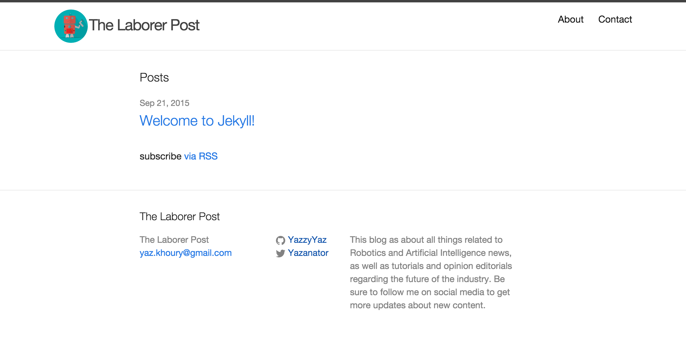

# The Laborer Post

By: Yaz Khoury

## Description

This is a blog I'm building using Jekyll to test the technology and hopefully
continue working with it to develop the application and the blog and the
design to something that can be online for people to read and comment on.

The following screenshot will show you what the application looks like.

Since it's in the early stages, anything is subject to change.

Topics in the Laborer Post are regarding robotics, A.I., and space.

For more information, email me at: yaz.khoury@gmail.com
